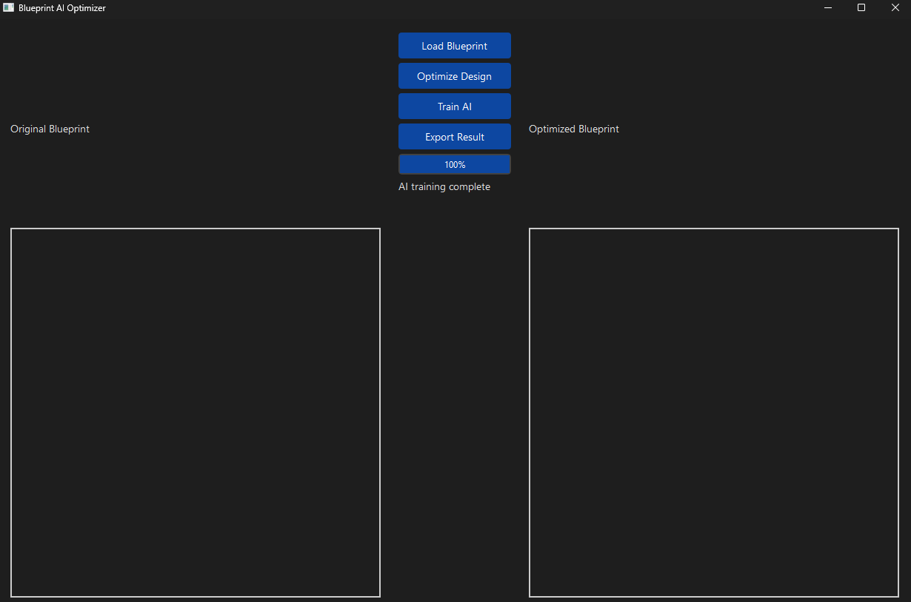

# Blueprint AI PCB Builder

An advanced AI-powered PCB design optimization tool that combines machine learning with professional PCB design principles. The application helps engineers and designers create better PCB layouts through automated pattern recognition, component placement optimization, and design rule validation.



## Features

- AI-powered PCB layout optimization
- Pattern recognition and analysis
- Component placement optimization
- Design rule checking (DRC)
- Manufacturing validation (DFM)
- Thermal analysis
- Modern dark-themed GUI interface
- Real-time optimization preview
- Export capabilities

## Installation

1. Clone the repository:
```bash
git clone https://github.com/yourusername/AIPCBBuilder.git
cd AIPCBBuilder

AIPCBBuilder/
├── blueprint_ai/
│   ├── __init__.py
│   ├── core/
│   │   ├── __init__.py
│   │   ├── blueprint_ai.py
│   │   ├── blueprint_analyzer.py
│   │   ├── pcb_optimizer.py
│   │   ├── design_validator.py
│   │   └── data_processor.py
│   └── gui/
│       ├── __init__.py
│       ├── main_window.py
│       └── style.qss
└── run.py

```
python -m venv venv

# Windows

venv\Scripts\activate

# Linux/Mac

source venv/bin/activate

#Install required packages:
pip install tensorflow numpy opencv-python PyQt6

#Run the application:

python run.py

#Usage:
Launch the application using python run.py

Click "Load Blueprint" to import your PCB design

Use "Optimize Design" to start the AI optimization process

Train the AI with your own datasets using "Train AI"

Export the optimized design using "Export Result"

#Required:
Python 3.8+
TensorFlow 2.x
OpenCV
PyQt6
NumPy

#Acknowledgments
Inspired by professional PCB design tools like Altium Designer and KiCad

Built with modern AI techniques for optimal design suggestions

Uses industry-standard design rules and manufacturing guidelines

